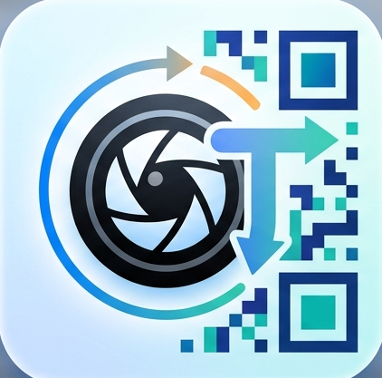
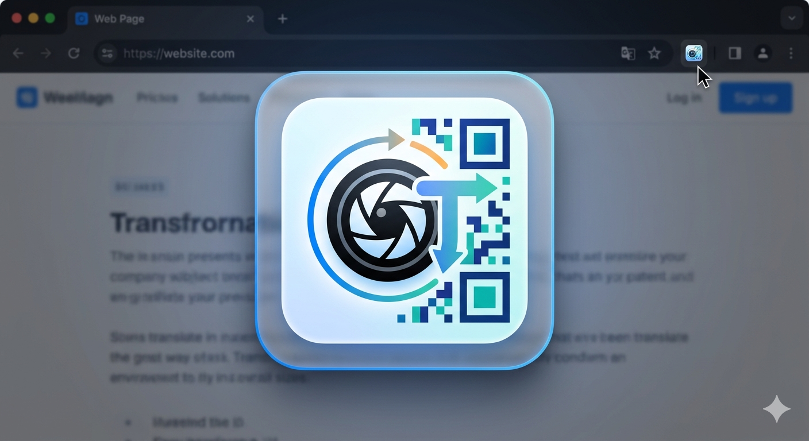

<div align="center">



# Snap & Translate AI

> Chrome Extension chụp vùng màn hình → OCR offline → Dịch thuật bằng AI

[]()
[](https://opensource.org/licenses/MIT)
[](https://developer.chrome.com/docs/extensions/develop/migrate/what-is-mv3)
[]()

[Features](#-tính-năng) • [Install](#-cài-đặt) • [Usage](#-hướng-dẫn-sử-dụng) • [Architecture](#-kiến-trúc) • [Roadmap](#-lộ-trình)

</div>

---

## 🎯 Tổng quan


Extension chụp bất kỳ vùng nào trên màn hình trình duyệt, trích xuất văn bản bằng OCR offline (Tesseract.js), sau đó dịch thuật qua 3 kênh: **Web ChatGPT**, **OpenAI API**, hoặc **Local LLM** (Ollama/LM Studio). Hỗ trợ đọc mã QR, lưu lịch sử, quản lý thuật ngữ chuyên ngành.

---

## ✨ Tính năng

### Core
| Tính năng | Mô tả |
|-----------|-------|
| 📸 **Snap & Translate** | Kéo chuột chọn vùng → OCR → Dịch AI |
| 📷 **Snap QR** | Chụp vùng chứa QR → Giải mã tức thì |
| 🔄 **Resnap** | Snap lại không cần mở extension, phân biệt QR/Dịch |
| ⌨️ **Keyboard Shortcut** | `Alt+X` kích hoạt nhanh |

### AI Channels
| Kênh | Đặc điểm |
|------|----------|
| 💬 **Web ChatGPT** | Miễn phí, dùng session ChatGPT có sẵn |git
| 🔗 **Server API** | OpenAI-compatible, siêu tốc |
| 🖥️ **Local API** | Ollama/LM Studio, offline, riêng tư |

### Data & Storage
| Tính năng | Mô tả |
|-----------|-------|
| 💾 **Memory** | Lịch sử snap, search, thống kê |
| 📁 **File Storage** | Auto-save PNG + text vào Downloads |
| 📊 **Analytics** | Dashboard theo tuần/tháng/tất cả |
| 📖 **Glossary** | Quản lý thuật ngữ, custom category, CSV import/export |
| 🔄 **Cloud Sync** | Export/Import JSON settings & memory |

---

## 📦 Cài đặt

### Yêu cầu
- Chrome 88+ (Manifest V3)
- Không cần server backend

### Các bước

1. **Tải source**
   ```bash
   git clone https://github.com/thinh1234-cyber/Snap-Translate-AI.git
   ```

2. **Mở Chrome Extensions**
   - Truy cập `chrome://extensions/`
   - Bật **Developer mode** (góc phải)

3. **Load extension**
   - Nhấn **Load unpacked**
   - Chọn thư mục project

4. **Sử dụng**
   - Click icon trên toolbar
   - Hoặc nhấn `Alt+X`

> 💡 Để snap trên file PDF local: Bật *"Allow access to file URLs"* trong chi tiết extension.

---

## 📖 Hướng dẫn sử dụng

### Snap Dịch
1. Mở extension → Click **Snap Dịch**
2. Kéo chuột chọn vùng văn bản
3. OCR tự động trích xuất chữ
4. Click **💬 Dịch** để gửi ChatGPT

### Snap QR
1. Click **Snap Đọc QR**
2. Chọn vùng chứa mã QR
3. Kết quả hiển thị ngay

---

## 🏗 Kiến trúc

### Cấu trúc thư mục
```
├── js/
│   ├── background.js          
│   ├── content.js             
│   ├── popup.js              
│   ├── options.js             
│   ├── chatgpt_automator.js   
│   └── modules/
│       ├── snap-controller.js     
│       ├── translation-engine.js  
│       ├── chatgpt-bridge.js      
│       ├── ocr-manager.js         
│       ├── memory-manager.js      
│       └── file-saver.js          
├── lib/
│   ├── tesseract.min.js      
│   ├── tesseract-core.wasm.js 
│   ├── jsQR.js               
│   └── lang-data/             
├── html/                      
├── css/                       
└── manifest.json        
```      
---

## 🔧 Công nghệ

| Layer | Technology |
|-------|------------|
| Extension | Manifest V3, Service Worker |
| OCR | Tesseract.js 4.x (WASM, offline) |
| QR | jsQR |
| AI | ChatGPT Web, OpenAI API, Local LLM |
| Storage | chrome.storage.sync + chrome.storage.local |
| UI | Vanilla JS, CSS Variables, Dark Mode |

---

## 📝 License

MIT — Xem [LICENSE](LICENSE)

---

<div align="center">
<p>Made with ❤️ by <b>Nguyễn Thịnh - Kyle</b></p>
</div>
