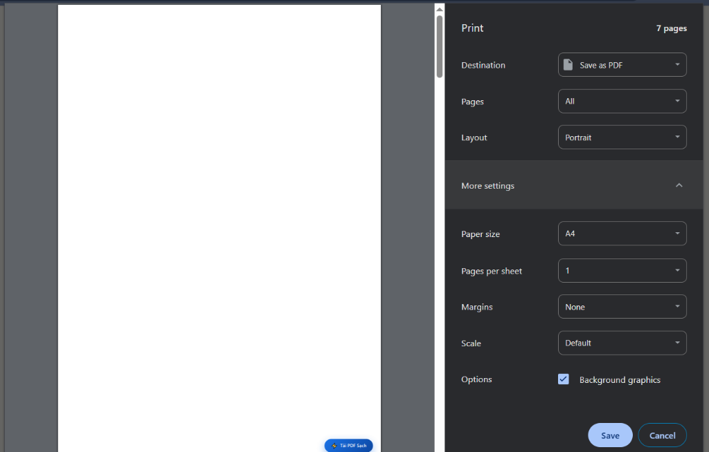

# Snap Decode

> Chrome Extension: Đọc mã QR thông minh & Tải tài liệu (Scribd, StuDocu, SlideShare)

[Tính năng](#-tính-năng-chính) • [Cài đặt](#-cài-đặt) • [Cách dùng](#-hướng-dẫn-sử-dụng) • [Lưu ý](#-lưu-ý-quan-trọng) • [Cấu hình in](#-cấu-hình-in-pdf-chuẩn)

---

## 🚀 Tính năng chính

1. **Đọc mã QR & Barcode siêu tốc:**
   - Tự động bật/tắt engine nền (Native Messaging), không tốn RAM khi không dùng.
   - Tự động nhận diện và định vị mã QR (ROI Localization) trong ~30ms.
2. **Tải tài liệu PDF chất lượng cao (100% Client-side):**
   - **Scribd:** Tự động chuyển link sạch, nạp 100% ảnh/vector, căn chuẩn khổ in A4 không lệch lề hay tràn trang.
   - **StuDocu:** Gỡ bỏ hoàn toàn mờ (`blur`), xóa paywall và mở khóa toàn bộ trang.
   - **SlideShare:** Tải toàn bộ slide độ phân giải gốc 2048px, tự động căn khổ ngang.
   - **Nút nổi tiện lợi:** Tự động hiện nút `⚡ Tải PDF` ở góc màn hình khi duyệt tài liệu.

---

## 📦 Cài đặt

1. **Kích hoạt Backend (Làm 1 lần duy nhất):**  
   Nhấp đúp file `setup_auto_backend.bat` để liên kết Extension với Backend.
2. **Cài đặt vào Chrome:**
   - Mở `chrome://extensions/` $\rightarrow$ Bật **Developer mode** (góc trên bên phải).
   - Chọn **Load unpacked** $\rightarrow$ Trỏ tới thư mục dự án `Snap-Translate-AI-main`.

---

## 📖 Hướng dẫn sử dụng

### 1. Quét mã QR
- Nhấp icon Extension $\rightarrow$ Chọn **Quét QR** (hoặc dùng phím tắt).
- Kéo chuột chọn vùng chứa mã trên màn hình $\rightarrow$ Kết quả hiển thị tức thì.
- **Cấu hình phím tắt:** Truy cập `chrome://extensions/shortcuts` trên trình duyệt để gán phím tắt tùy ý (gợi ý: `Alt + X`).

### 2. Tải tài liệu (Scribd / StuDocu / SlideShare)
- Mở trang tài liệu cần tải.
- Nhấp nút nổi **⚡ Tải PDF** ở góc dưới bên phải (hoặc mở popup Extension bấm **Tải Tài Liệu**).
- Chờ tiến trình chạy 100%, hộp thoại in xuất hiện $\rightarrow$ Chọn **Save as PDF**.

---

## 💡 Lưu ý quan trọng

> [!TIP]
> - **SlideShare:** Khi chuyển từ bài thuyết trình này sang bài khác trong cùng tab (slide $n \rightarrow n+1$), hãy **F5 (Reload lại trang)** trước khi bấm tải để nạp mới toàn bộ danh sách ảnh 2048px của bài mới.
> - **StuDocu:** Khi vừa mở tài liệu, hãy **bấm nút `⚡ Tải PDF` ngay** mà không lướt trang xuống dưới để tránh web kích hoạt pop-up bắt mua gói Premium. Nếu lỡ bị chặn, chỉ cần **mở lại link trong Tab ẩn danh (Incognito)** là tải bình thường.
> - **Scribd:** Giữ nguyên tab trong quá trình quét nạp cho đến khi hộp thoại in tự động mở ra.

---

## ⚙️ Cấu hình in PDF chuẩn

Để tài liệu xuất ra đẹp nhất, không viền trắng thừa và sắc nét 100%:

  

 

| Mục | Giá trị chọn | Ghi chú |
|---|---|---|
| **Destination** | **Save as PDF** | Lưu file dạng `.pdf` |
| **Pages** | **All** | In tất cả các trang |
| **Layout** | **Portrait** *(hoặc Landscape)* | Dọc cho văn bản, Ngang cho SlideShare |
| **Paper size** | **A4** | Khổ chuẩn quốc tế |
| **Margins** | **None** | Tràn viền, loại bỏ lề trắng thừa |
| **Scale** | **Default** | Tự động căn chỉnh vừa trang |
| **Options** | ✅ **Background graphics** | **Bắt buộc tích** để hiển thị ảnh, màu và công thức |

*(Chrome sẽ tự động ghi nhớ cấu hình này cho các lần in sau).*
